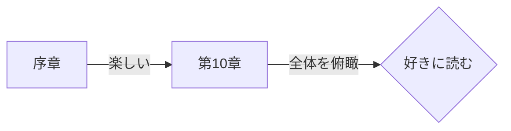

こんにちは。イオンスマートテクノロジー株式会社（AST）でSREチームの林 aka [もりはや](https://twitter.com/morihaya55)です。

2024-04-25にイベント「[LEADING QUALITY](https://www.kadokawa.co.jp/product/302309001510)から紐解く、QAエンジニアのキャリア展開」にパネルディスカッションの話す人（パネリストと呼ぶらしい）として参加し、大変楽しく学びもあったのでブログで紹介します。

一緒に登壇したメンバーの熱量もそうですが、会場にいらしていた多くのQAエンジニアの皆さんから熱いものを頂きました...!!

https://globis.connpass.com/event/314089/

## どんなイベントか

このイベントはQAエンジニアのキャリアをテーマにしたイベントで、軸として書籍[『LEADING QUALITY』](https://www.kadokawa.co.jp/product/302309001510)をベースにパネルディスカッション形式でテーマを掘り下げていくイベントでした。通常”キャリア”を題材にすると話題は広がりますが、本イベントのように特定の本をベースにする試みは面白く、結果的に話の軸ができて良いテーマだったなと感じています。

主催と場所の提供はグロービスさんで、中でも今回のメインパネリストであり[『LEADING QUALITY』](https://www.kadokawa.co.jp/product/302309001510)翻訳者その人”河原田　政典”さんこと”Markin' QualityのMark”さんがグロービスさん所属であるところが大きいでしょう。さすがグロービスさんは優れた教育のサービスを提供しているだけあり、卒業式などを行う立派なホールをお持ちでした。（XのPostはテンション上がって"ホール"が"ボール"になってます...)

@[tweet](https://x.com/morihaya55/status/1783428477477106138)

[Connpassページ](https://globis.connpass.com/event/314089/)を見ていただければわかりますが、登壇者は以下の構成でグロービスCTOの末永さんをモデレータに迎え、ベテランQAのMarkさんとおおひらさんを主軸としつつ、QAエンジニアではなくSREの私と言ったメンバーでした。

- 株式会社グロービス QA Engineer 河原田政典（Mark Ward） [@mkwrd](https://twitter.com/mkwrd)
- 株式会社ログラス QA Engineer 大平祐介（おおひら） [@oo4ra](https://twitter.com/oo4ra)
- 株式会社グロービス CTO 末永昌也 [@sue738](https://twitter.com/sue738)
- イオンスマートテクノロジー株式会社 SRE 林如弥 (もりはや)　[@morihaya55](https://twitter.com/morihaya55)＊私です

## パネルディスカッションを振り返って

上述した写真の通り会場のグロービスさんのホールは適度な広さで(当日は半分に仕切っていた)、スピーカーと参加の皆さんの距離感が近く、話しながら頷きや目線が合うなど一方的ではないことが適度な緊張感につながり、振り返ると普段以上に饒舌になっていました。

ディスカッションのテーマは大きく3つ用意されていて、モデレータの末永さんのスムーズな進行に乗ってほぼ即興でパネリスト同士で目を合わせて探り合いながらディスカッションをしました。

1. 「みなさんのキャリアの変遷とこれから目指していきたい事」
2. 「LEADING QUALITYを通したキャリア観のアップデート」
3. 「各社のQAエンジニアに求めるもの・役割」

### 1. 「みなさんのキャリアの変遷とこれから目指していきたい事」

イベント開始すぐにそれぞれの自己紹介を行なっていましたが、各自のキャリアを深掘りしながら参加者の皆さんに何か参考になればと話したのが最初のテーマです。

Markさんからはどん底の時代を経て不死鳥の如く立ち上がりQAと翻訳の道に進んだ勇ましさを、おおひらさんからは”テスト”を行うことでプロダクトに貢献する真摯な思いで気づけば幅広いロールになっていた真摯さを、末永さんからはベンチャーから世界大会のハッカソン出場からの1人目エンジニアそしてCTOといった波乱のエピソードが紹介されました。

私からも（自分語りは小恥ずかしいところもありましたが）新人時代にパイプ椅子を並べて会議室で寝たハードワークを経てインフラエンジニアとなり、SREの考え方に感銘を受け現在に至った話をさせていただきました。

私以外の三者三様のキャリアの片鱗に触れることができて刺激的で興味の尽きない時間でした。

愉快な壇上の写真をおおひらさんがXにPostしていましたので引用します。楽しそうな空気感を思い出すナイスショットです。

@[tweet](https://x.com/oo4ra/status/1783460165943206201)

＊なお、私はカラフルなパーカーを着ていますが、これは当社イオングループのカラーをイメージして近い色をチョイスしたものです。懇親会で分かりやすいかなと考えた選択です。

### 2. 「LEADING QUALITYを通したキャリア観のアップデート」

1つ目のテーマから盛り上がってしまい予定より時間を遅らせつつも、続いて本イベントのメインテーマである書籍[『LEADING QUALITY』](https://www.kadokawa.co.jp/product/302309001510)を通したキャリア感のアップデートについて話しました。

途中は脱線し本書が如何に面白いのかを語る時間になりかけましたが、モデレータの末永さんの適切な方向修正も入りそれぞれの見解を話していきました。

話した要点を上げれば以下のような点が本書によって学べたり、知ってはいたがより鮮明に理解することができるようになって自身のキャリアへの向き合い方の変化に繋がったことを話しました。

- ３つの品質ナラティブ（責任/テスト/価値）を知ることで課題などをより解像度高く理解できること
- チーム・組織への働きかけの重要性と、そのための具体的な取り組みの紹介による視座の広がり
- プロダクト・事業におけるQAの重要性とROIを提示するための具体的なアプローチ

### 3. 「各社のQAエンジニアに求めるもの・役割」

1つ目と2つ目のテーマでかなり時間を使っていましたが、最後のテーマで各社のQAエンジニアに求める点を紹介しました。

これに関してはオフラインであることもあって少々の内輪話もあり楽しかったのですが、ここでは各社の募集ページの掲載に留めます。

- [株式会社グロービスさんの募集ページ](https://globis.co.jp/careers/)
- [株式会社ログラスさんの募集ページ](https://job.loglass.jp/)

なお当社ASTも、QAエンジニアの皆さんはもちろん多くの仲間を募集していますので、ページ下部のリンクから興味を持っていただければ幸いです。

### ある意味で一番盛り上がった懇親会

そして始まる懇親会です。感覚ではおよそ80%以上の方が残ってくれて、並べていた椅子を端に寄せて立食形式でピザとおつまみと飲み物を片手に多くの皆さんと交流をさせてもらいました。改めて素敵な会場と飲食を提供してくれたグロービスさんにお礼申し上げます。

以下は懇親会前の顔出しOKな参加者のみなさんとの集合写真です。この時会場にはピザの匂いが伝わっており、みなさん少々浮かれ気味かもしれません。（冗談です）

参加者の多くがQAエンジニアの方で、泣く子も黙るようなベテランから、駆け出しテスター（自称）の方など多様な方がいらっしゃり、キャリアについて、QAについて、なぜかアジャイル開発、ただの雑談など幅広く会話ができて大変楽しい時間になりました。

会では多くの話をしましたが、SREの私が特筆するならグロービスさんのSREマネージャである[@chroju](https://twitter.com/chroju)さんとのSRE談義は、会場のお片付けもあり短いながらも話題の尽きぬ良い時間となりました。今後私たちASTのSREチームとグロービスのSREチームの交流が実現できるとより楽しく学びになりそうですね！！（当方ASTには[Kubernetesのアップグレードの達人](https://speakerdeck.com/aeonpeople/the-aks-upgrade-strategy-of-aeon)がいますから！）

## 終わりに

こうしてあっという間の2時間強が過ぎ、充実した楽しい時間を終えることができました。QAエンジニアの方々のイベントへ、SREとしてのロールで参加することでアウェイになることを懸念していましたが、皆様暖かく知的好奇心に溢れる方ばかりで良い場に参加できたなと感慨深いです。改めてありがとうございました。

## おまけ：LEADING　QUALITYのオススメの読み方

おまけです。ここまで書いて書籍[『LEADING QUALITY』](https://www.kadokawa.co.jp/product/302309001510)の面白さを挙げてないことに気づいたので、簡単なリコメンドをします。

コンパクトで読みやすい本書ですが、4周ほどした私からオススメの読み方を紹介します。普段本を読み慣れていない方も、きっと完読までいかなくても読み進められる流れです。

図にすると以下です。

### まずは”序章”を読もう

[『LEADING QUALITY』](https://www.kadokawa.co.jp/product/302309001510)を読み始めるとニール・ブラウン氏の”まえがき”と翻訳者Markさんの”まえがき”がありますが、（誤解を恐れずに書くと）スパッと飛ばして良いです。本書の面白さを味わってから読んだ方がそれらを感慨深く読めます。

私のおすすめとしてはまず”序章”を読み始めてください。”序章”には始まりから一気に引き込まれる素晴らしいエピソードが仕掛けとして用意されています。

”序章”のさわりを紹介すると以下です。新規ユーザが増えない問題が何だったのかはぜひ書籍で確認してください。

- ワールドワイドに展開するWebサービスがあり、特定の国だけでユーザ数が伸びない課題を抱えていた
- サービスの内容や価格を考えればもっとユーザが多くあるべきで、それは他の地域からも間違っていないはず
- QAのエンジニアから報告されたのは「Sign Up時の情報入力にその地域固有の文化と合わない問題がある」とのことだが、それは我々の常識からは大きく外れていた
- それを解決することでユーザー数は大幅に向上した、QAの効果すごい！！

### 次に"第10章"を読もう、見事な振り返りになっているから

"序章"を読み終え、勢いのまま1章に進んでももちろん構いません。しかし私は最終章でもある"第10章"をおすすめします。

"第10章"は第1章から第9章までをコンパクトかつ要点をまとめた綺麗な振り返りの内容となっています。私が初めて[『LEADING QUALITY』](https://www.kadokawa.co.jp/product/302309001510)を読んだ時は1ページからシーケンシャルに読みまして、この"第10章"を読んだ時には思わず「全部この章に書いてあるじゃないか！」と叫んだ程です。

本を読む時に、目次を先に読んで全体の流れを俯瞰してから内容に入る技（？）がありますが、本書では目次より詳細で要点がまとまっている”第10章”から読むことで、全体の流れと本書のエッセンスを踏まえることができ、各章をより読みやすくなると考えます。

なお私と同じSRE領域に興味がある方には”第7章”がSREに極めて近いテーマで読んでいて楽しいでしょう。SLIに近い考え方やカナリアリリース、オンコールなどの話が出てきます。

### 注釈を通して翻訳者と伴走する

本書の特徴と魅力の一つに”力の入った注釈”がある点もお伝えしたいです。本書の注釈方式は良くあるページ下や巻末にまとめる形式ではなく、本部中に挿入される形式です。具体的には以下のようになります。

> P22より
> 例えば、ユニットテスト[注釈：単体テストとも呼ばれ、一般的にQAエンジニアではなく開発エンジニアがソースコードに対して実施する費用対効果が極めて高いテスト]と探索的テスト[注釈：テスト実施者が...(略)

読み始めた当初、本文にそのまま注釈が挿入される本書のスタイルに私は戸惑いました。なぜなら”ユニットテスト”のように自身が知っている言葉であればさらっと読み流せるはずが、注釈によって倍以上の文字量になりますし、注釈の数自体も1ページに3つ以上あることも珍しくないほど頻出だったためです。

しかしこれが癖になっていきます。これらの注釈は翻訳者の明確な意思として挿入されたものであり、翻訳者の熱量が込められているように感じます。引用した”ユニットテスト”の例においても「費用対効果が極めて高い」の表現は必須ではありませんが、敢えてその表現を行なっているところに良いコダワリを感じられます。

個人的には”コーヒーブレイク”の注釈は「この一般的な言葉にここまでの注釈入れるのか」と笑いながら読んでしまって楽しいほどでしたし、”遅行指標（lagging indicator）”のように自身が知らない言葉を補完してくれて助かることも多くありましたし、引用もした”ユニットテスト”のように既知の言葉でもより言葉の深みを増すような注釈に唸ることもありました。

このような素晴らしい”注釈”によって、本書は日本語化されるにあたって原著よりも良い厚みを増して日本に届いたのだと考えています。Markさんグッジョブです。

### 翻訳者の紹介記事もあるよ
また翻訳者Markさんの以下の記事を読んでも楽しさが倍増するでしょう。（タイトルにもあるとおり偏執的な良さがあります）
上述した”注釈”についての思いも記載されていて読んで「なるほど＆やはり！」となりました。

[『LEADING QUALITY』翻訳者の偏執的こだわりメモ](https://qiita.com/mkwrd/items/6f9cad04cd21bb20780a)

## 仲間を募集しています！！
私たちイオンスマートテクノロジーではQAエンジニアをはじめとした様々な職種を積極的に採用中です！
これから益々面白いフェーズへ突入していく最中ですので、興味のある方は是非カジュアル面談などで話を聞いてください！

## イオングループで、一緒に働きませんか？

イオングループでは、エンジニアを積極採用中です。少しでもご興味もった方は、キャリア登録やカジュアル面談登録などもしていただけると嬉しいです。
皆さまとお話できるのを楽しみにしています！

