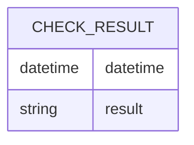

こんにちは。イオンスマートテクノロジー株式会社（AST）でSREチームの林 aka [もりはや](https://twitter.com/morihaya55)です。

当社で利用している[New Relic](https://newrelic.com/jp)は”フルスタックオブザーバビリティ”を提供してくれる素晴らしいサービスです。本記事ではNew Relicが提供している機能の一つ[Synthetic](https://docs.newrelic.com/jp/docs/new-relic-solutions/best-practices-guides/full-stack-observability/synthetic-monitoring-best-practices-guide/)を利用したアラートが自動復旧しなかった問題が、New Relicユーザの多くの方（？）が経験する[”ゼロヌル問題”](https://newrelic.com/jp/blog/how-to-relic/alert-zeronull)であり、私たちがなぜハマるのかを自分なりに考えてみました。（要因は複数あるため、シリーズ化するかもしれません）

## TL;DR

はじめに要点を記載します。

- New RelicのSyntheticのアラートが自動復旧しない状態に気づいた
- 調べるとNew Relicでよくある質問”ゼロNull”が原因だった
- `filter` によるサブ句を利用しないとWHERE句で要素に一致するデータがない場合、0ではなくNullの値が返される事象だった
    - 解説記事:[NRQLアラート条件を作成する - 例: 返されたnull値対ゼロ値](https://docs.newrelic.com/jp/docs/alerts-applied-intelligence/new-relic-alerts/alert-conditions/create-nrql-alert-conditions/#example-null-zero)

 
## New Relicの”ゼロNull”問題とは

New Relicの”ゼロNull”問題について簡単に説明します。詳しくはNew Relicの中の方が記載している[”ゼロヌル問題”](https://newrelic.com/jp/blog/how-to-relic/alert-zeronull)をみていただくのが早いですが、実際に回復しないアラートを体験したユーザ目線で記載します。

要点は以下です。

- New Relicのアラートを設定する場合、Alert Conditionのthresholdsで閾値を定量的に設定する必要がある
- Syntheticなどの監視の結果を定量化するために `COUNT` を利用するのが一般的
- New Relicの `COUNT` はWHERE句でHitするものがないと `0` ではなく `Null` がリターンされる
- WHERE句の条件で `SyntheticがFAILEDした場合はCOUNTして1を返す` 場合、テストが正常終了した際に `not FAILED` が永久的にNullがリターンされて復旧することがない

と箇条書きでまとめても、いまいちピンとこないかもしれません...(私のように）

### COUNTの結果はゼロが返るものだという誤解

`COUNT` で `0` ではなくNullがリターンされることへの誤解の理由を説明するために、New Relicを離れて一般的なDBの話をします。（New Relicの仕様と異なるため、あえて誤解と表現しました）

例としての以下のテーブル及びデータが存在する場合に、MySQLやPostgreSQLがどのような動作をするかを確認します。

- テーブル"CHECK_RESULT"は2つのカラムをもつ
- カラム1は日付型の"datetime" *PostgreSQLの場合は"timestamp"
- カラム2は文字列型の"result"
    - "result"には"FAILED"か"SUCCESS"のどちらかが入る




結果は以下に記した通り、MySQLとPostgreSQLは `COUNT` 関数で `WHERE` を利用したクエリがヒットしない場合ゼロ（０）を返します。これらのDBでの経験がNew Relicの仕様と異なることが私の勘違いに繋がりました。（そして多くのDB経験者にも同じことが起きるのではと考えています）

#### MySQLの場合

コンテナを使ってサクッと環境を用意します。私のPC環境ではコンテナ操作を `podman` を利用していますがdockerをお使いの方はそのまま `docker` へ置き換えても動作するはずです。

```shell
$ podman pull mysql:latest
$ podman run --name some-mysql -e MYSQL_ROOT_PASSWORD=my-secret-pw -d mysql:latest
$ podman exec -it some-mysql mysql -p
-> my-secret-pw を入れる
```

起動と接続に続いてテーブルを作成します。いきなり `create table` を実行すると以下のエラーが出たため `use mysql` でDBを選択しました。

> ERROR 1046 (3D000): No database selected

```sql
> use mysql
> create table check_result(datetime datetime, result varchar(10));
```

さて、テーブルが作成されレコードが1行もない状態で `count` をしてみましょう。

```sql
mysql> select count(*) from check_result;
+----------+
| count(*) |
+----------+
|        0 |
+----------+
1 row in set (0.01 sec)
```

結果はゼロです。Nullではありません。続いていくつかレコードを挿入します。イメージとして5分間隔のチェックで 10:10, 10:15 の2回だけFAILEDが記録された状況の再現です。

```sql
mysql> insert into check_result values ('2024-05-09 10:00:00', 'SUCCESS');
mysql> insert into check_result values ('2024-05-09 10:05:00', 'SUCCESS');
mysql> insert into check_result values ('2024-05-09 10:10:00', 'FAILED');
mysql> insert into check_result values ('2024-05-09 10:15:00', 'FAILED');
mysql> insert into check_result values ('2024-05-09 10:20:00', 'SUCCESS');
mysql> insert into check_result values ('2024-05-09 10:25:00', 'SUCCESS');
mysql> insert into check_result values ('2024-05-09 10:30:00', 'SUCCESS');
```

この状態でFAILEDをカウントすれば、当然2となります。
```sql
mysql> SELECT count(*) from check_result WHERE result = 'FAILED';
+----------+
| count(*) |
+----------+
|        2 |
+----------+
1 row in set (0.00 sec)
```

New RelicのWindow Durationが5minの場合を想定し、復旧後の 10:25-10:30の間をカウントします。

```sql
mysql> SELECT count(*) from check_result WHERE result = 'FAILED' AND datetime BETWEEN '2024-05-09 10:25:00' AND '2024-05-09 10:30:00';
+----------+
| count(*) |
+----------+
|        0 |
+----------+
1 row in set (0.00 sec)
```

このようにMySQLではFAILEDなレコードがHITしない場合は0になるのが仕様です。


#### PostgreSQLの場合

こちらもコンテナを使ってサクッと環境を用意します。繰り返しになりますが私のPC環境ではコンテナ操作を `podman` を利用していますが `docker` へ置き換えても動作するはずです。

```shell
$ podman pull postgres:latest
$ podman run --name some-postgres -e POSTGRES_PASSWORD=mysecretpassword -d postgres:latest
$ podman exec -it some-postgres psql -U postgres
```

起動と接続に続いてテーブルを作成します。

```sql
postgres=# create table check_result(datetime timestamp, result varchar(10));
```

さて、テーブルが作成されレコードが1行もない状態で `count` をしてみましょう。

```sql
postgres=# select count(*) from check_result;
 count
-------
     0
(1 row)
```

結果はゼロです。Nullではありません。続いていくつかレコードを挿入します。イメージとして5分間隔のチェックで 10:10, 10:15 の2回だけFAILEDが記録された状況の再現です。

```sql
postgres=# insert into check_result values ('2024-05-09 10:05:00', 'SUCCESS');
postgres=# insert into check_result values ('2024-05-09 10:10:00', 'FAILED');
postgres=# insert into check_result values ('2024-05-09 10:15:00', 'FAILED');
postgres=# insert into check_result values ('2024-05-09 10:20:00', 'SUCCESS');
postgres=# insert into check_result values ('2024-05-09 10:25:00', 'SUCCESS');
postgres=# insert into check_result values ('2024-05-09 10:30:00', 'SUCCESS');
```

この状態でFAILEDをカウントすれば、当然2となります。
```sql
postgres=# SELECT count(*) from check_result WHERE result = 'FAILED';
 count
-------
     2
(1 row)
```

New RelicのWindow Durationが5minの場合を想定し、復旧後の 10:25-10:30の間をカウントします。

```sql
postgres=# SELECT count(*) from check_result WHERE result = 'FAILED' AND datetime BETWEEN '2024-05-09 10:25:00' AND '2024-05-09 10:30:00';
 count
-------
     0
(1 row)
```

このようにMySQLと同様にPostgreSQLではFAILEDなレコードがHITしない場合は0になるのが仕様です。

### New Relicのクエリ順序によるNullの動作

上述したように過去のRDBMSでの経験からCOUNTの結果は `0` だと考えてしまいましたが、New Relicは仕様が異なります。

New Relicでは、アラートのためのNRQLの `COUNT(*)` が `WHERE result = 'FAILED'` の場合 `FAILED` がなければ `0` ではなく `Null` が返されます。

この動作は以下の説明を読むことでわかりやすくなります。

[NRQLアラート条件を作成する - NRQL条件および演算のクエリ順序](https://docs.newrelic.com/jp/docs/alerts-applied-intelligence/new-relic-alerts/alert-conditions/create-nrql-alert-conditions/#query-order)

該当部分を引用します。

> ### NRQL条件および演算のクエリ順序 
> デフォルトで、集計ウィンドウの期間は1分ですが、必要に応じてウィンドウは変更できます。集計ウィンドウが何であろうと、New RelicはNRQL条件のクエリの関数を使用して、そのウィンドウのデータを集計します。クエリは構文解析され、以下の順序でシステムによって実行されます。
> 
> 1. FROM 句。どのイベントタイプを取り込む必要があるのか？
> 2. WHERE 句。何を除去できるのか？
> 3. SELECT 句。今、フィルタリングしたデータセットから何の情報を返す必要があるのか？

NRQLの動作として `2. WHERE句` の段階で全てのデータが除去された場合 `3. SELECT句` は実行されず `Null` が返されることとなります。

そうです、ここで `0` ではなく `Null` が返されるのです。（大事なことなため2回書いた）

## 対策としての `filter` 関数

この（個人的に）直感的ではないNullが返却される動作に対して、New Relicはもちろん対策を用意してくれています。

[”ゼロヌル問題”](https://newrelic.com/jp/blog/how-to-relic/alert-zeronull)より以下に引用します。

> また、別の方法としては、SELECT 句で filter 関数を用いる方法が挙げられます。NRQL の WHERE 句で条件を儲けるのでなく、SELECT 句の filter 関数でフィルタリングした結果を count することで 数値としてのゼロ (0) が記録できます。
> 
> SELECT filter(count(*), where result = 'FAILED') FROM SyntheticCheck WHERE monitorName = 'My Cool Monitor'

つまり、Synthethicを活用する私たちのアラートのNRQLは `filter` を用いた以下のような形にすることでNullではなく確実に `0` か `1` を結果にとることが出来るようになりました。

```SQL
SELECT filter(count(*), WHERE result = 'FAILED') AS 'Failures'
FROM SyntheticCheck
WHERE entityGuid IN
  (‘<Synthetic monitorsのGuIDその1>’,
   ‘<Synthetic monitorsのGuIDその2>’,
   ‘<Synthetic monitorsのGuIDそのN...>’)
FACET monitorName
```

## まとめ

以上、New Relicの”ゼロNull”問題にハマる理由を、一般的なDBの例も踏まえて理由づけしてみました。違いを理解することで少しでもNew Relicユーザの皆様の誤解（あえて強い表現）が減らせると幸いです。


PS: `filter` を使ってNullを回避したはずが、Window Durationの兼ね合いでやっぱりNullを得ていて、閾値を下回らなかった話もあるため気が向いたら連載予定です。

## イオングループで、一緒に働きませんか？

イオングループでは、エンジニアを積極採用中です。少しでもご興味もった方は、キャリア登録やカジュアル面談登録などもしていただけると嬉しいです。
皆さまとお話できるのを楽しみにしています！

[](https://engineer-recuruiting.aeon.info/)