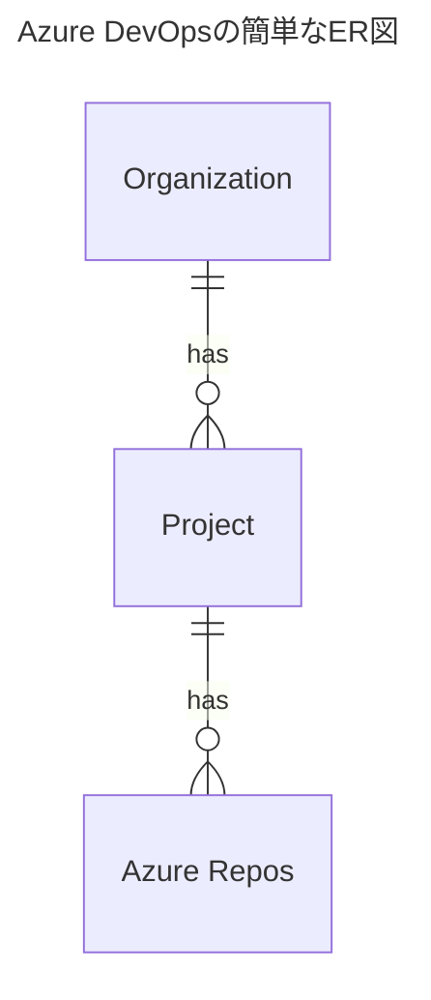

こんにちは。イオンスマートテクノロジー株式会社（通称AST）でSREの林 aka [もりはや](https://twitter.com/morihaya55)です。

当社は各種コードのリポジトリの一つとしてAzure DevOpsのAzure Reposを活用しています。（他にGitHubもあります）

https://azure.microsoft.com/ja-jp/products/devops/

https://azure.microsoft.com/ja-jp/products/devops/repos/

Azure ReposにはWeb上での編集や各種Commit・Blame・PRなど十分以上のコードの置き場としての機能があり便利に利用できています。ただし、後述する課題を感じて手元にcloneするモチベーションが湧き簡単な工夫をしたため紹介します。

## TL;DR

こんなコマンドを使ってまとめてcloneするコマンドを生成しました。

```bash
# gitコマンド用
$ az repos list --org <Organization Name> --project <Project Name> | jq -r '.[] | select(.isDisabled == false) | .sshUrl' | sed -E 's/^/git clone /g'

# ghqコマンド用
$ az repos list --org <Organization Name> --project <Project Name> | jq -r '.[] | select(.isDisabled == false) | .sshUrl' | sed -E 's/^/ghq get /g'
```

これによって以下の様なコマンドのリストを作成できるため、あとは `{}` などのサブシェルで一気に流すも良し、一行ずつ丁寧に流すも良しです。

```txt
git clone git@ssh.dev.azure.com:v3/<Organization Name>/<Projcet Name>/<Repo Name A>
git clone git@ssh.dev.azure.com:v3/<Organization Name>/<Projcet Name>/<Repo Name B>
git clone git@ssh.dev.azure.com:v3/<Organization Name>/<Projcet Name>/<Repo Name C>
...
```

## 課題：検索機能が少々物足りない

リポジトリとして十分以上の機能を持つAzure Reposですが、特定キーワードでのコードの横断検索などを行う時に思い通りの結果を得られないことがありました。

具体的には以下のような記述へ辿り着くために `Standard` や `Stan*` で検索すればHitします。しかし `Stan` や `tanda` や `*tanda*` などの単語として意味をなさない文字列での検索ではHitしない状況でした。

```txt
# Standard Hoge Moge Project
echo "Standard and more"
```

日頃からVisual Studio Codeでの作業や、ターミナルの `grep` などで文字列検索に慣れている身としてはこの検索精度には物足りなさを感じていました。

## 対策:ローカルにまとめてcloneする

対策として、各Azure Reposからにローカルにcloneすることにしました。ブラウザのAzure Reposの画面から一つずつclone用のURLを取得して実行していくことも可能ですが、その数が多くなるとなかなかの手間になります。


当社(AST)も規模の大きいシステムを扱っており、Azure DevOpsのOrganizationの中に複数のProjectがあり、それぞれのProjectが複数のRepo(Azure Repos)を持ちます。中にはSREチームが主に扱うProjectが存在し、SREチームのメンバーとしてはそのProject内のほぼすべてのRepoを扱っていくことになるため、まとめてcloneしたいモチベーションが発生しました。



一括作業ならCLIが便利です。そのため `az` コマンドを用いて一括で取得する方法を検討し、以下のコマンドで実現しました。

```bash
# gitコマンド用
$ az repos list --org <Organization Name> --project <Project Name> | jq -r '.[] | select(.isDisabled == false) | .sshUrl' | sed -E 's/^/git clone /g'

# ghqコマンド用
$ az repos list --org <Organization Name> --project <Project Name> | jq -r '.[] | select(.isDisabled == false) | .sshUrl' | sed -E 's/^/ghq get /g'
```

### 簡単なコマンド解説

- `az repos list` : [MS Learn](https://learn.microsoft.com/ja-jp/cli/azure/repos?view=azure-cli-latest#az-repos-list)にある通り、プロジェクトのGitリポジトリの一覧を表示するコマンドです
- `--org, --project` : `az repos list` に対してそれぞれOrganizationとProjectを指定するオプションです。 `az devops configure` を利用してデフォルトを事前設定すれば省略できます([MSLearn参照](https://learn.microsoft.com/en-us/cli/azure/devops?view=azure-cli-latest#az-devops-configure))。
- `jq` : `az` コマンドはデフォルトで結果をJSONで返却するため `jq` コマンドを利用して必要な情報を取得します。最近では[jenv](https://github.com/ynqa/jnv)を使うとフィルタを組み立てしやすいです
- `-r` : `jq` コマンドのオプションである `-r` はロングオプションで `--raw-output` と指定できる通り、'"'を表示せずに結果を表示します。見た目がスッキリする目的で指定していますが必須ではありません
- `select(.isDisabled == false)` : これは工夫の一つです。Azure ReposではRepoをDisableの状態にすることができます。DisabledとなったRepoからはcloneすることができないため、リストから除外する必要があるための条件式です(cloneエラーを気にせず流すこともできますが、心臓に良くないため）
- `.sshUrl` : cloneするためのURLをJSONの結果から取得します。 (httpsを使う人は `remoteUrl` を利用するのかもしれませんが私は基本的にssh派です)
- `sed -E 's/^/git clone /g'` : 取得したURLの先頭に `git clone ` の文字列を挿入します。私は `ghq` を愛用しているため `'s/^/ghq get /g'` としました

## まとめ

以上、Azure Reposから一つずつcloneする手間をCLIでまとめてできるようにした話でした。
これによってAzure Reposを使う案件で新しいProjectに携わることになっても、シュッと関連するReposをローカルに持ってくることができる様になりました。入社したばかりの私的には大変便利なためブログで紹介いたしました。それでは皆さんEnjoy Azure！！

## イオングループで、一緒に働きませんか？

イオングループでは、エンジニアを積極採用中です。少しでもご興味もった方は、キャリア登録やカジュアル面談登録などもしていただけると嬉しいです。
皆さまとお話できるのを楽しみにしています！

[](https://engineer-recuruiting.aeon.info/)