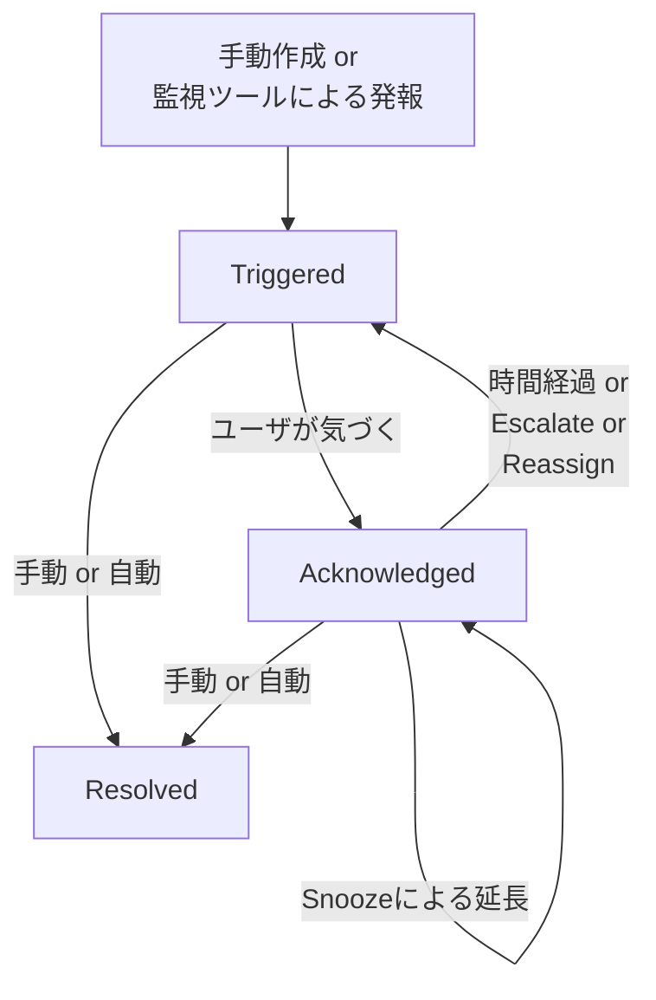
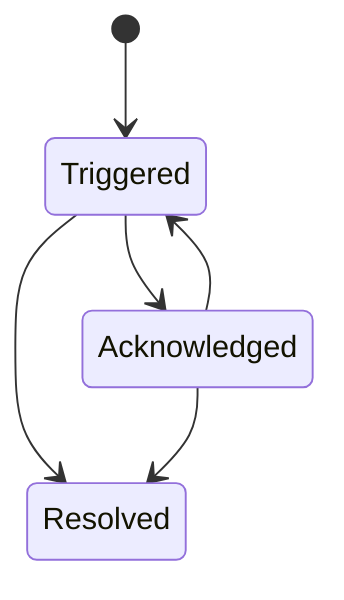

こんにちは。イオンスマートテクノロジー株式会社（AST）でSREチームの林 aka [もりはや](https://twitter.com/morihaya55)です。

本記事ではPagerDutyのIncident（インシデント）のライフサイクルについて、現在（2024-05-24時点）の公式ドキュメントよりも分かりやすく図にして説明する試みです。

＊念の為、私はPagerDutyの公式ドキュメントに対し長年好意的で英語全盛の頃からの読者です。さらに日本法人設立後は日本語ドキュメントの拡充を肌で感じ、時にはPagerDuty Universityを英語で受講するくらいには公式に対して尊敬の念があることを明記いたします。

よって基本的には公式ドキュメントを見ていただくのが良いです。

https://support.pagerduty.com/lang-ja/docs/incidents#incident-lifecycle


## TL;DR
PagerDutyのIncident Lifecycleを理解するための要点を記載します。

- Incidentの状態はわずか3つしかありません
    - Triggered（トリガード）：IncidentがアラートとしてPagerDutyに通知された状態
    - Acknowkledged（アックナレッジド）：On-Call Userの誰かがIncidentを認識した状態
    - Resolved（リゾルブド）：Incidentが解決した状態
- 周辺の知識として、状態を変更するための以下も覚えておくと良いでしょう
    - Escalate（エスカレート）: Incdentを関連する特定(Escalation Policy内）のユーザに転送します
    - Reassign（リアサイン）: Incidentを任意のユーザorグループに転送します
    - Snooze（スヌーズ）: Incidentを一定期間保留します
    - Add Responders（アド レスポンダーズ）: Incidentに対して対応者を追加します



## 背景
当社は現在、インシデント管理プラットフォームであるPagerDutyを活用できてはいない状況です。それでもPagerDutyについて記述するのは、当社が今後PagerDutyを導入し、それを契機にインシデントレスポンスについて改めて見直しを行う取り組みの最中だからです。

## 公式ドキュメント： インシデントライフサイクル

PagerDutyのドキュメント群は高品質です。加えて近年日本法人が設立されて以来は日本語翻訳および日本語ネイティブのドキュメントが素晴らしい質とスピードで展開されています。

本記事でも取り上げるIncidentのライフサイクルについても、日本語で読めるドキュメントが用意されています。 

https://support.pagerduty.com/lang-ja/docs/incidents

## Incidentの３つの状態

PagerDutyにおけるIncidentの状態は以下の3つです。

- Triggered（トリガード）：IncidentがアラートとしてPagerDutyに通知された状態
- Acknowkledged（アックナレッジド）：On-Call Userの誰かがIncidentを認識した状態
- Resolved（リゾルブド）：Incidentが解決した状態

3つの状態は、基本的には以下の流れを辿ります。（例外があります）

1. 人もしくはモニタリングによってAlertがIncidentとして生成され `Triggered` される
2. 適切なOn-Call ユーザに対して通知が行われる（Escalation Policyの役割）
3. 気づいたOn-Callユーザが承認操作して `Acknowledged` となる
4. 問題が解決されたタイミングで手動・自動により `Resolved` となる


## Incidentの３つの状態を図で表現する
公式ドキュメントは当然読めば納得のいく適切な内容ですが、読み切るための文字数は `9000文字以上` です。（なお本記事は約半分の `4500文字強` です）

本記事ではIncidentの３つの状態を図にすることで分かりやすくなるかを試みます。



あなたがMermaidのユーザなら以下がコードになります。

```js
stateDiagram-v2
    [*] --> Triggered
    Triggered --> Acknowledged
    Acknowledged --> Triggered
    Triggered --> Resolved
    Acknowledged --> Resolved
```

図にしたことで、文章で読むよりもシンプルになった印象がないでしょうか。

## Incidentの状態が変化する契機（Reassign, Escalate, etc..）

Incidentの状態が変化する契機で代表的なものはいくつかあります。

- 人間による `Escalate` 操作によるIncidentのEscalation Policy内ユーザへの転送
- 人間による `Reassign` 操作によるIncidentの任意ユーザor任意グループへの転送
- 人間による `Snooze` 操作による `Acknowledged` 時間の延長（状態は変わらない）
- 人間による `Resolve` 操作によるIncidentの解決
- 時間経過によるTimeoutによって `Acknowledged` から再び `Triggered` へ
- モニタリングシステムなどによる自動でのIncidentの解決

上述したように、状態が変わる契機は人間による手動操作もあれば、時間経過やアラートを作成したモニタリングシステム（当社の場合はNew Relicなどが該当）による自動で処理されるもあります。

なおPagerDutyには上記の他に `Add Responders` や `Merge` や `Run Workflow` などの多様な操作があり、それぞれ便利ですので詳しくはドキュメントを参照してください。

## 変化する契機も図で表現してみる

基本の3つの状態（Triggered, Acknowledged, Resolved）と、それの遷移する契機をまとめて図に表現すると以下になります。（＊ `Merge` など他に多くの操作がありますが省略しています）


あなたがMermaidのユーザなら以下がコードになります。

```js
flowchart TD
    a["手動作成 or<br>監視ツールによる発報"]-->Triggered
    Triggered --"ユーザが気づく"--> Acknowledged
    Triggered --"手動 or 自動"--> Resolved
    Acknowledged --"手動 or 自動"--> Resolved
    Acknowledged --"時間経過 or<br> Escalate or<br> Reassign"--> Triggered
```

状態が変わる契機も表現したことで少し複雑になった印象がありますが、まだ許せる範囲でしょう。


## まとめ
さて、シンプルなMermaidによる図がわかりやすいと感じていただけたでしょうか。最後に改めて要点だけ述べて本記事を終わります。

- Incidentの状態はわずか3つしかありません
    - Triggered（トリガード）：IncidentがアラートとしてPagerDutyに通知された状態
    - Acknowkledged（アックナレッジド）：On-Call Userの誰かがIncidentを認識した状態
    - Resolved（リゾルブド）：Incidentが解決した状態

これらを踏まえつつ、PagerDutyを活用したモダンなIncident Responceの実践に向けて進めていきたいですね。

## 余談1:（宣伝）技術書典16で「PagerDuty FANBOOK Vol.1」を頒布します
ここから宣伝です。私（もりはや）を含むPagerDutyを愛する同士が集まり、2024-05-26(Sun)に開催される「[技術書典16](https://techbookfest.org/event/tbf16)」で「PagerDuty FANBOOK Vol.1」と題したPagerDutyの知見が集まった本を頒布いたします。

中身はPagerDutyを愛する7名の著者によるバラエティ溢れるものに仕上がっていますので、興味のある方はチェックいただけると幸いです。

https://techbookfest.org/product/fdr8Dy1kLRUbaBRgeqK0wF

## 余談2:イベントPagerDuty Japan Community Meetup Vol.3開催
加えて、2024-05-27(Mon)には「PagerDuty Japan Community Meetup Vol.3」がハイブリッドで予定されていますので、少しでもPagerDutyに興味のある方はご参加いただくと良い学びの場となりそうです。

さらに今回はスペシャルゲストとして『[【改訂新版】システム障害対応の教科書](https://gihyo.jp/book/2024/978-4-297-14012-0)』の著者 木村誠明氏の話が聞けるまたとない機会となっています。PagerDutyへの興味以前にサービス運用に携わり障害対応を行う多くの方に刺激となる予感がありますね...!

https://pagerduty.connpass.com/event/318379/

以上、日本国内でも広がり続けるPagerDutyの輪に、期待と興奮を覚える最近でした。

## イオングループで、一緒に働きませんか？

イオングループでは、エンジニアを積極採用中です。少しでもご興味もった方は、キャリア登録やカジュアル面談登録などもしていただけると嬉しいです。
皆さまとお話できるのを楽しみにしています！

[](https://engineer-recuruiting.aeon.info/)