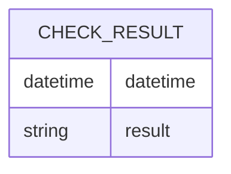

こんにちは。イオンスマートテクノロジー株式会社（AST）でSREチームの林 aka [もりはや](https://twitter.com/morihaya55)です。

当社で利用している[New Relic](https://newrelic.com/jp)は”フルスタックオブザーバビリティ”を提供してくれる素晴らしいサービスです。本記事ではNew Relicが提供している機能の一つ[Synthetic](https://docs.newrelic.com/jp/docs/new-relic-solutions/best-practices-guides/full-stack-observability/synthetic-monitoring-best-practices-guide/)を利用したアラートが自動復旧しなかった問題についての原因と理由を記します。

## TL;DR

はじめに要点を記載します。

- New RelicのSyntheticのアラートが自動復旧しない状態に気づいた
- 調べると[Lost signalの設定](https://newrelic.com/jp/blog/best-practices/best-practice-for-alerting-log-and-synthetic#toc--synthetic-incident-)が必要だった
- 理由として、アラートのためのNRQLの `COUNT(*)` が `WHERE result = 'FAILED'` の場合 `FAILED` がなければ `0` ではなく `NULL` が返されるためだと考えたが異なるようだ
    - 解説記事:[NRQLアラート条件を作成する - NRQL条件および演算のクエリ順序](https://docs.newrelic.com/jp/docs/alerts-applied-intelligence/new-relic-alerts/alert-conditions/create-nrql-alert-conditions/#query-order)
- `filter` によるサブ句を利用してフィルタ要素に一致するデータがない場合、0の値が返される状態ではあった
    - 解説記事:[NRQLアラート条件を作成する - 例: 返されたnull値対ゼロ値](https://docs.newrelic.com/jp/docs/alerts-applied-intelligence/new-relic-alerts/alert-conditions/create-nrql-alert-conditions/#example-null-zero)
- 0が返っており閾値 `>=1.0` を下回っているにも関わらずIssueはクローズされなかった
- 

 
## 発生していた課題

この課題に対して気付きを得たのはインシデント管理プラットフォームを提供する[PagerDuty](https://www.pagerduty.co.jp/)の試験運用中でした。当社はNew Relicの多様な機能をプロダクション環境で活用しており、複数のNew RelicのアカウントでAPMを始めとした機能をフル活用して多くのAlertが様々な連携先へ通知される仕組みが整っています。今後それらのアラートをPagerDutyに集約し、より柔軟なアラート運用を実現するべく検証を行なっていた際、特定のインシデントだけPagerDuty上で自動クローズしないことに気づきました。


## 調査を開始

今後PagerDutyで数多くのアラートを管理していく上で、自動復旧しないアラートを放置することはできないと考え調査を開始しました。

### アラートポリシーのクエリ

PagerDutyのIncident画面から該当するNew RelicのIssueページのURLに飛び、そのIssueがどんなアラートポリシーによって発報されたかを確認します。（この辺りのサービス間連携は大変優れていて体験が良いです）

確認するとNew RelicのSynthetic Monitoringの結果を利用したアラートポリシーによって発報したアラートが自動復旧しないことがわかりました。具体的には以下のようなクエリを用いていました。

```SQL
SELECT filter(count(*), WHERE result = 'FAILED') AS 'Failures'
FROM SyntheticCheck
WHERE entityGuid IN
  (‘<Synthetic monitorsのGuIDその1>’,
   ‘<Synthetic monitorsのGuIDその2>’,
   ‘<Synthetic monitorsのGuIDそのN...>’)
FACET monitorName
```

### アラートポリシーの閾値

このクエリに対しThresholdsは以下を設定していました。簡単に解説すると5分間のうち上記のクエリ（Syntheticの失敗件数）が1以上ならWarning、6以上ならCriticalとする閾値となります。

意図としては「1つのAPIでチェック失敗なら警告、6つ以上同時に起きたらやばいためクリティカル」と言ったところでしょう。（正確な意図はこのアラートを作成した担当者に今度尋ねてみます）

```
Incidents will open with a:

 Critical: Query result is above or equals 6 at least once in 5 minutes
 Warning: Query result is above or equals 1 at least once in 5 minutes
```


### ドキュメントによると自動復旧する条件は満たしている（間違いだったが）

次に確認したのはNew Relicのドキュメント - [アラート条件を正しく設定するための詳細ガイド](https://newrelic.com/jp/blog/how-to-relic/understand-nrql-alert-condition)の”アラート状態と復旧状態の判定”の部分です。

以下に引用します。

> 集計ウインドウが閉じてクエリ結果が得られると、アラート条件の閾値と評価期間に照合して判定を行います。閾値を超過しており、かつ同一のIncidentが存在しなければ、新たにIncidentを作成します。
> 
> 判定の結果、閾値に指定した評価期間にわたって、アラート条件に違反していない状態が継続すると、復旧状態(recover state)とみなされ、そのアラート条件から発生したIncidentが自動的にクローズされます。
> 
> 自動復旧の判定は、アラート条件のWHERE句に該当するデータが継続して発生しており、クエリの結果として正常な状態であると判断できることが前提となります。
アラート状態の時のみ値が得られて、正常時にはクエリ結果が存在しないようなアラート条件では、この復旧判定は使用できません。代わりに、Loss of signalの設定による自動クローズが有効です。

今読み直すと、3段落目に明確に「アラート状態の時のみ値が得られて、正常時にはクエリ結果が存在しないようなアラート条件では、この復旧判定は使用できません。代わりに、Loss of signalの設定による自動クローズが有効です。」と記載があるのですが、この時の私はこれが今回のケースに該当するとは考えませんでした。

理由として上述したクエリが「正常時にはクエリ結果が存在しないようなアラート条件」であると考えていなかったためです。

### COUNTの結果はゼロが返るものだという誤解

誤解の理由を説明するために、New Relicを離れて一般的なDBの話をします。

例としての以下のテーブル及びデータが存在する場合に、MySQLやPostgreSQLがどのような動作をするかを確認します。

- テーブル"CHECK_RESULT"は2つのカラムをもつ
- カラム1は日付型の"datetime" *PostgreSQLの場合は"timestamp"
- カラム2は文字列型の"result"
    - "result"には"FAILED"か"SUCCESS"のどちらかが入る




結果は以下に記した通り、MySQLとPostgreSQLは `COUNT` 関数で `WHERE` を利用したクエリがヒットしない場合ゼロ（０）を返します。これらのDBでの経験がNew Relicの仕様と異なることが私の勘違いに繋がりました。（そして多くのDB経験者にも同じことが起きるのではと考えています）

:::details MySQLの場合

コンテナを使ってサクッと環境を用意します。私のPC環境ではコンテナ操作を `podman` を利用していますがdockerをお使いの方はそのまま `docker` へ置き換えても動作するはずです。

```shell
$ podman pull mysql:latest
$ podman run --name some-mysql -e MYSQL_ROOT_PASSWORD=my-secret-pw -d mysql:latest
$ podman exec -it some-mysql mysql -p
-> my-secret-pw を入れる
```

起動と接続に続いてテーブルを作成します。いきなり `create table` を実行すると以下のエラーが出たため `use mysql` でDBを選択しました。

> ERROR 1046 (3D000): No database selected

```sql
> use mysql
> create table check_result(datetime datetime, result varchar(10));
```

さて、テーブルが作成されレコードが1行もない状態で `count` をしてみましょう。

```sql
mysql> select count(*) from check_result;
+----------+
| count(*) |
+----------+
|        0 |
+----------+
1 row in set (0.01 sec)
```

結果はゼロです。NULLではありません。続いていくつかレコードを挿入します。イメージとして5分間隔のチェックで 10:10, 10:15 の2回だけFAILEDが記録された状況の再現です。

```sql
mysql> insert into check_result values ('2024-04-30 10:00:00', 'SUCCESS');
mysql> insert into check_result values ('2024-04-30 10:05:00', 'SUCCESS');
mysql> insert into check_result values ('2024-04-30 10:10:00', 'FAILED');
mysql> insert into check_result values ('2024-04-30 10:15:00', 'FAILED');
mysql> insert into check_result values ('2024-04-30 10:20:00', 'SUCCESS');
mysql> insert into check_result values ('2024-04-30 10:25:00', 'SUCCESS');
mysql> insert into check_result values ('2024-04-30 10:30:00', 'SUCCESS');
```

この状態でFAILEDをカウントすれば、当然2となります。
```sql
mysql> SELECT count(*) from check_result WHERE result = 'FAILED';
+----------+
| count(*) |
+----------+
|        2 |
+----------+
1 row in set (0.00 sec)
```

New RelicのWindow Durationが5minの場合を想定し、復旧後の 10:25-10:30の間をカウントします。

```sql
mysql> SELECT count(*) from check_result WHERE result = 'FAILED' AND datetime BETWEEN '2024-04-30 10:25:00' AND '2024-04-30 10:30:00';
+----------+
| count(*) |
+----------+
|        0 |
+----------+
1 row in set (0.00 sec)
```

このようにMySQLではFAILEDなレコードがHITしない場合は0になるのが仕様です。

:::

:::details PostgreSQLの場合

こちらもコンテナを使ってサクッと環境を用意します。繰り返しになりますが私のPC環境ではコンテナ操作を `podman` を利用していますが `docker` へ置き換えても動作するはずです。

```shell
$ podman pull postgres:latest
$ podman run --name some-postgres -e POSTGRES_PASSWORD=mysecretpassword -d postgres:latest
$ podman exec -it some-postgres psql -U postgres
```

起動と接続に続いてテーブルを作成します。

```sql
postgres=# create table check_result(datetime timestamp, result varchar(10));
```

さて、テーブルが作成されレコードが1行もない状態で `count` をしてみましょう。

```sql
postgres=# select count(*) from check_result;
 count
-------
     0
(1 row)
```

結果はゼロです。NULLではありません。続いていくつかレコードを挿入します。イメージとして5分間隔のチェックで 10:10, 10:15 の2回だけFAILEDが記録された状況の再現です。

```sql
postgres=# insert into check_result values ('2024-04-30 10:05:00', 'SUCCESS');
postgres=# insert into check_result values ('2024-04-30 10:10:00', 'FAILED');
postgres=# insert into check_result values ('2024-04-30 10:15:00', 'FAILED');
postgres=# insert into check_result values ('2024-04-30 10:20:00', 'SUCCESS');
postgres=# insert into check_result values ('2024-04-30 10:25:00', 'SUCCESS');
postgres=# insert into check_result values ('2024-04-30 10:30:00', 'SUCCESS');
```

この状態でFAILEDをカウントすれば、当然2となります。
```sql
postgres=# SELECT count(*) from check_result WHERE result = 'FAILED';
 count
-------
     2
(1 row)
```

New RelicのWindow Durationが5minの場合を想定し、復旧後の 10:25-10:30の間をカウントします。

```sql
postgres=# SELECT count(*) from check_result WHERE result = 'FAILED' AND datetime BETWEEN '2024-04-30 10:25:00' AND '2024-04-30 10:30:00';
 count
-------
     0
(1 row)
```

このようにMySQLと同様にPostgreSQLではFAILEDなレコードがHITしない場合は0になるのが仕様です。

:::


### New Relicのクエリ順序によるNULLの動作

上述したように過去のRDBMSでの経験からCOUNTの結果はゼロだと考えてしまいましたが、New Relicは仕様が異なります。

New Relicでは、アラートのためのNRQLの `COUNT(*)` が `WHERE result = 'FAILED'` の場合 `FAILED` がなければ `0` ではなく `NULL` が返されます。

この動作は以下の説明を読むことでわかりやすくなります。

[NRQLアラート条件を作成する - NRQL条件および演算のクエリ順序](https://docs.newrelic.com/jp/docs/alerts-applied-intelligence/new-relic-alerts/alert-conditions/create-nrql-alert-conditions/#query-order)

該当部分を引用します。

> ### NRQL条件および演算のクエリ順序 
> デフォルトで、集計ウィンドウの期間は1分ですが、必要に応じてウィンドウは変更できます。集計ウィンドウが何であろうと、New RelicはNRQL条件のクエリの関数を使用して、そのウィンドウのデータを集計します。クエリは構文解析され、以下の順序でシステムによって実行されます。
> 
> 1. FROM 句。どのイベントタイプを取り込む必要があるのか？
> 2. WHERE 句。何を除去できるのか？
> 3. SELECT 句。今、フィルタリングしたデータセットから何の情報を返す必要があるのか？

NRQLの動作として `2. WHERE句` の段階で全てのデータが除去された場合 `3. SELECT句` は実行されず `NULL` が返されることとなります。


### `NULL` 対策としての `filter` サブ句だったがIssueは復旧しなかった

このような `NULL` 対策として `filter` によるサブ句を利用してフィルタ要素に一致するデータがない場合でも、0の値が返す方法が紹介されています。

- 解説記事:[NRQLアラート条件を作成する - 例: 返されたnull値対ゼロ値](https://docs.newrelic.com/jp/docs/alerts-applied-intelligence/new-relic-alerts/alert-conditions/create-nrql-alert-conditions/#example-null-zero)

改めて今回のアラートポリシーのNRQLを引用します。 `filter` が利用されており `NULL` ではなく0が返る状態でした。

```SQL
SELECT filter(count(*), WHERE result = 'FAILED') AS 'Failures'
FROM SyntheticCheck
WHERE entityGuid IN
  (‘<Synthetic monitorsのGuIDその1>’,
   ‘<Synthetic monitorsのGuIDその2>’,
   ‘<Synthetic monitorsのGuIDそのN...>’)
FACET monitorName
```

それでも以下のようにIssueは自動で閉じることはありませんでした。


## 対策として"Lost signal threshold"

さて、ここまで来てようやく対策の話になります。

