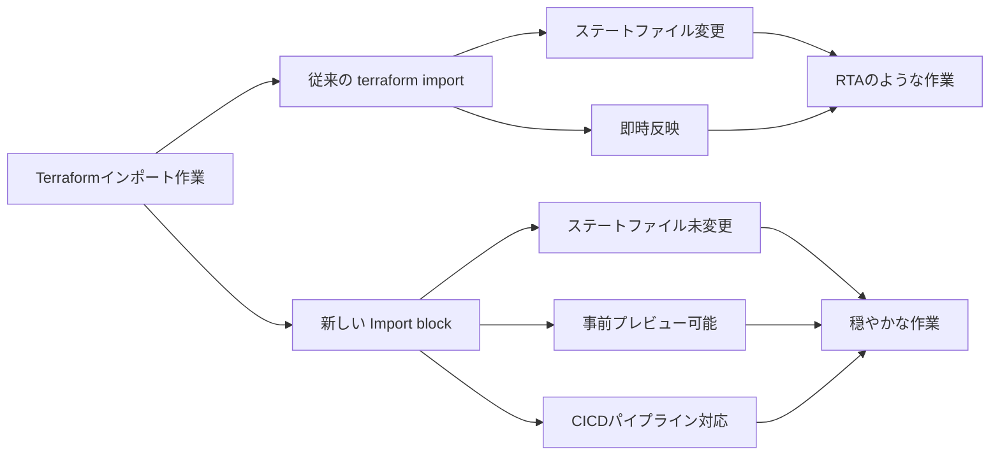

こんにちは。イオンスマートテクノロジー株式会社（AST）でSREチームの林 aka [もりはや](https://twitter.com/morihaya55)です。

Terraformを一定以上扱ってきた方であれば `terraform import` コマンドを苦労しながら実行した経験があるのではないでしょうか。私自身も5年以上Terraformを扱う中で何度も `terraform import` を行ってきました。

一般的に `terraform import` では以下を行います。

1. 実態に合わせてコードを整える
2. 実態を指定するコマンドを組み立てる
3. ステートファイルに取り込む
4. 差分が出たら地道にコードを整えて `terraform plan` を実行する
5. 4を繰り返して"No changes"となるまでチューニングする

これらの作業はTerraform初見では難しく、個人的にTerraform中級者への登竜門として `terraform import` が試金石のひとつになると考えています。（地道で泥臭くそして簡単ではない...)

これまで `terraform import` で育ってきた自分は[Terraform v1.5](https://developer.hashicorp.com/terraform/language/import)で提供された"Import block"の存在を知ってはいましたが、特に必要性を感じずにこれまでやれていました。それは"Import block"が提供される以前のシステムを運用していたことで `terraform import` が通用する状況だったからと言えます。

しかしイオンスマートテクノロジー株式会社へジョインし環境が変わったことで"Import block"の有用性に気づけた喜びを本記事として紹介します。

## TL;DR
結論を先に書くと、Terraformの"Import block"には以下のメリットがあります。

- ステートファイルを汚さずに `terraform plan` の段階でコードと実態の差分を確認できる
- HCP Terraformを利用していれば、ローカル環境がととのっていなくてもインポート作業を進められる

この2点で合点がいった方は以降を読む必要はありませんが、「だから？別に `terraform import` でもよくない？」と感じた方は読み進めていただけると嬉しいです。

要点を図に表すと以下になります。

## Import blockのここが良い
ここからは"Import block"の良さについて解説していきます。

### ステートファイルを変更せずにコードと実態の差分を確認できる

キーワードは”ステートファイルを変更せずに”です。これがどれだけ嬉しいことなのかを `terraform import` コマンドとの違いと比較して説明します。

#### 一度 `terraform import` をしたのなら、完全にやり切るしかない

従来の `terraform import` は、コマンドが成功するとステートファイルにリソースの実状況を取り込んで追記します。この時コードはリソースを指定するためにリソースの種類とキー（名前）と必須パラメタがあれば多くの場合インポート処理が正常に行われます。

この仕様から、従来の `terraform import` は以下の流れで行われてきました。（例外はあると思いますが）

1. 最低限のコードを書く
2. `terraform import` を実行
3. 大量の差分が `terraform plan` の結果として出る
4. その差分を整形しながらコードへ落とし込む
5. 3と4を繰り返して"No change"になったら完了

つまり、一度 `terraform import` を実行してしまったら、差分が消えるまでとことんコードの修正をやり切る必要があります。そうしなければ他の要件でコードの変更が発生した場合に差分として出てしまい、他のメンバーに迷惑をかけてしまう状況になるためです。

ある意味 `terraform import` を実行した瞬間に"誰かに迷惑が掛かる前にNo changesを目指すRTA"が開始される状況です。

補足: コードの整形が難しいような状況であれば `terraform state rm` を実行することでインポートしたステートファイルの変更を消すことができますが、これも危険な行為と言えます...

#### "Import block" なら穏やかにインポートを準備できる

一方で"Import block"は対応する時の心理的負荷が大きく減少します。以下は[ドキュメント](https://developer.hashicorp.com/terraform/language/import)からの引用です。

> Unlike the terraform import command, configuration-driven import using import blocks is predictable, works with CICD pipelines, and lets you preview an import operation before modifying state.

意訳するなら「 `terraform import` と違って"Import block"ならステートファイルを変更せずにインポートができるから、事前検証ができてCICDパイプラインとかでも使えるぜ！」とあります。

Terraformを扱う多くのCICDパイプラインでは、PRで `terraform plan` が走り、マージによって `terraform apply` が実行されるでしょう。
"Import block"を利用することでPRの段階でインポートした結果のレビューを受けることができ、ステートファイルは変更されていないため他の作業への影響もありません。

こうして落ち着いてレビューも通し"No changes"となったコードをマージした後で `terraform apply` を実行することでやっとステートファイルにインポート処理が実行されるのです。

”No changesを目指すRTA” になる `terraform import` とは全く体験が異なる点が伝わるでしょうか。

### ローカル環境が整っていなくてもよい

これはもしかするとHCP Terraformを利用しているメリットかもしれませんが大変嬉しい点だったため紹介します。（S3やAzure Storageの場合はできない...？）

#### `terraform import` するためには各種アクセス権が必要

`terraform import` は大変便利な機能ですが、使用するためにはいくつかの条件があります。
具体的には以下の通りです。

- Terraformがインストールされていること
- ステートファイルに書き込みアクセスが可能であること（ローカルではなくリモートにおくのが一般的）
- インポートする対象に読み取りアクセスが可能であること

これらは一度整えてしまえば当然の状態となりますが「環境構築がつらい/めんどう」と言った声は少なくありません。

#### "Import block"なら整えた環境をシェアできる

一方で"Import block"の場合は、上述したようにCICDパイプラインとしてインポートの結果を確認することができます。

多くのVCS（GitHubやAzure Reposなど）はWebブラウザで利用できるエディタを備えているため、ブラウザで該当のリポジトリさえ開くことができればインポートを作業を行うことができます。

ローカルにTerraformのインストールすら不要で、影響を出すことなく結果を確認することができる点において、"Import block"を利用したインポート作業が如何に心理的ハードルが低くなったことが伝わるでしょうか。

## 終わりに

以上、つらつらとTerraformの"Import block"の良さを書いてみました。私は今でも `terraform import` のヒリヒリした作業が嫌いではありませんが、進化していくTerraformの素晴らしい機能に気づくことができたことに喜びを感じました。

知識としては知っていても、体験として解ることの違いを改めて感じることができたとも言えます。

Terraform自体の機能はもちろん、Terraformのエコシステムの充実ぶりを思うと、全然使いこなせていないだろうことに軽いめまいと想いを馳せつつ、今後もキッカケがある時は率先して手を動かして学んでいこうと考えています。それではみなさまEnjoy Terraform!!

## イオングループで、一緒に働きませんか？

イオングループでは、エンジニアを積極採用中です。少しでもご興味もった方は、キャリア登録やカジュアル面談登録などもしていただけると嬉しいです。
皆さまとお話できるのを楽しみにしています！

