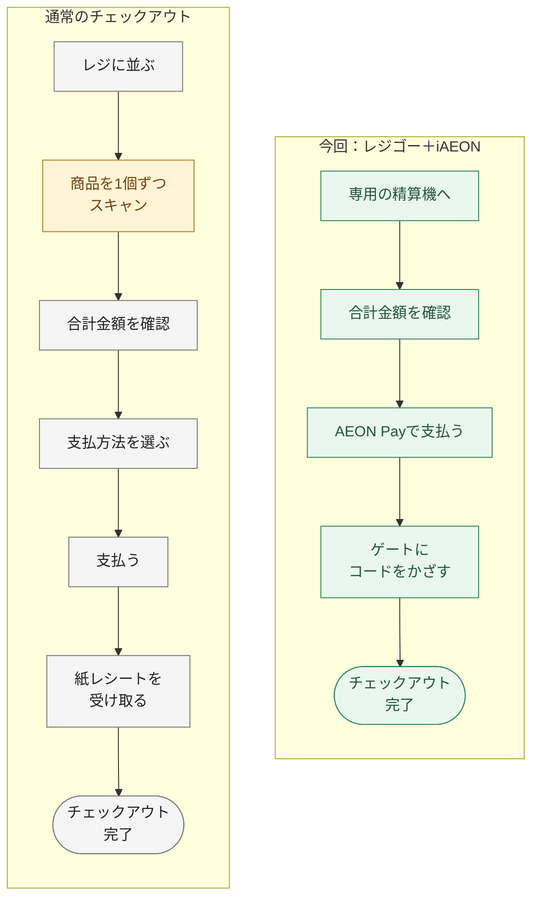

## はじめに

こんにちは。イオンスマートテクノロジー株式会社（AST）でSREチームの林 aka [もりはや](https://twitter.com/morihaya55)です。

以前の記事では、iAEONのアイコンを長押しして、会員コードやAEON Payのバーコードをすぐに表示する方法をご紹介しました。

https://zenn.dev/aeonpeople/articles/morihaya-20250418-iaeon-recommend-feature

今回はその続編として、私が普段のお買物で使っている「レジゴー x AEON Pay x 電子レシート」の組み合わせを紹介します。今回も技術の話は少なめに、ひとりのiAEONユーザとして便利だと感じている使い方のお話です。

### レジに着いてからの流れを比べてみる

まずは通常のチェックアウトと、今回紹介する組み合わせを並べてみます。今回のフローは、買物中に商品スキャンを済ませ、会員情報もiAEONから連携済みの状態です。図ではレジゴー専用レジで会計する場合を紹介します。

商品を1個ずつスキャンする時間を、お買物中に分散できるのが大きな違いです。会計時に財布を取り出さず、紙レシートも増えないので、レジでの作業が軽くなります。

※レジゴーでも混雑時は順番待ちが発生します。クーポンの利用や年齢確認など、お買物の内容による追加操作は図では省略しています。

## TL;DR

- iAEONからレジゴーを起動すると、買物中の商品スキャンからAEON Payでの支払いまでスムーズです
- 買物中に合計金額を確認でき、財布を取り出さずにお買物できます
- 電子レシートなら紙が増えず、後から購入履歴も見返せますし、黄色いレシートで地域の団体を応援できます！

## 買物中はレジゴー、支払いはAEON Pay、記録は電子レシート

冒頭からAEON専門用語とも言える名前がいくつか出てきたので、まずはそれぞれの役割を紹介します。

| 機能 | お買物のどこで使う？ |
| --- | --- |
| レジゴー | お買物中にお客様自身が商品のバーコードをスキャンして登録します |
| AEON Pay | スマホでお買物の代金を支払える決済サービスです |
| 電子レシート | 支払い後のレシートをiAEONで受け取り、購入履歴を見返せます |

レジゴーは、お客様が自分で商品のバーコードをスキャンしながらお買物できるサービスです。
商品をカゴに入れるときにバーコードを読み込んで商品を登録していくため、会計時にまとめて商品をスキャンする手間を省けます。

加えて商品追加時の合計金額がリアルタイムで表示されますので、ついついありがちな”買い過ぎ”対策にも活用いただけます。

レジゴー対応店舗の多くでは、専用のデバイスが入り口付近に設置されており、それを利用することもできますが、今回は「自分のスマホで、iAEONからレジゴーを起動して支払いまで一気通貫で行う」使い方をご紹介します。

iAEONから利用すると、iAEONに登録しているAEON Pay、WAON POINT、電子レシート、オーナーズカードの情報が自動連携されます。会計時にiAEONの会員バーコードを別途スキャンする必要もありません。
準備や設定は少し必要ですが、会計時に会員コードを出し直さずに済む点が、私には便利です。

https://www.regigo.jp/campaign/iaeon/

:::message
レジゴーや電子レシートは対象店舗で利用できます。レジゴー公式サイトの「iAEON対応」店舗と、iAEONの「お気に入り店舗」に表示される「電子レシート」アイコンをご確認ください。
:::

### 電子レシートにすると「iAEONレポート」機能も利用できる

iAEONの電子レシートには紙資源の節約やレシート自体の振り返りが可能となる他に「iAEONレポート」が利用できるメリットがあります。

iAEONレポートでは、次のような情報を確認できます。家計の振り返りにぜひご活用ください。

- お買い物データを自動で可視化。「食料品」「衣料品」「日用品」「その他」の4つのカテゴリーに分類して簡易レポートとして表示します
- イオングループの対象店舗にてご利用いただくと、決済方法を問わず、過去13カ月分の支出額をまとめて確認できます
- 累計獲得ポイントとクーポン割引金額の表示で、お買い物で獲得したWAON POINTの把握が可能になります
- イオングループが発行するクーポン利用による値引き額もまとめて確認できるようになります

詳しくは、[電子レシート・iAEONレポートの公式案内](https://www.aeon.com/aeonapp/service/digitalreceipt)もご覧ください。

## 準備：最初にAEON Payと電子レシートを準備しておく

では実際に一連の機能を活用するための準備をご紹介します。
お買物に出かける前に、iAEONでAEON Payを使えるように設定しておきます。すでにAEON Payを使っている方は、そのままで大丈夫です。

電子レシートは、会員コード画面の「設定を表示」から「電子レシート」の切替をONにします。これで対象店舗のお買物では、紙の代わりにiAEONでレシートを受け取れるようになります。

設定方法は公式の案内にも載っています。

https://www.aeon.com/aeonapp/service/digitalreceipt

準備ができたら、利用する店舗をiAEONの「お気に入り店舗」に登録します。トップ画面でその店舗を表示し、「レジゴー」のアイコンをタップします。

レジゴーの利用方法はこちらも詳しいです。

https://www.regigo.jp/

レジゴーの画面が起動したら店舗を選び、「お買い物をはじめる」からお買物を始めます。詳しくは[iAEON公式FAQの利用手順](https://aeonapp-faq.aeon.com/kb/article/iaeonアプリでレジゴーを利用する方法を教えてください。/)もご覧ください。

## レジゴーなら、買物中にカゴの中身と合計金額がわかる

使い方は、商品を手に取ったらバーコードをスキャンして、カゴに入れるだけです。

スキャンした商品と合計金額はレジゴーの画面で確認できます。レジに着く前から「今どれくらい買っているか」がわかるのは、使ってみるとかなり便利です。カゴの中を探さなくても、登録した商品の一覧を見返せます。

なお、アプリの表示金額には一部の割引が反映されていません。お客さま感謝デーなどの割引は精算時に適用されるため、最終的な支払金額は精算機で確認してください。

https://www.regigo.jp/faq/

### 店舗の専用端末も便利ですが、自分のスマホでもぜひ！

店頭にあるレジゴー専用端末は、手に取ってすぐに使えるのでオススメです。自分のスマホで商品をスキャンすることに抵抗がある方も、まずはこちらから試せます。

一方で、普段のアプリが快適に動くスマホをお持ちの方には、ご自身のスマホでのレジゴーもぜひ体験していただきたいです。

使い慣れたスマホでサクサクと商品バーコードをスキャンしながらお買物できるのが、私のオススメしたいポイントです。
iAEONから起動すれば会員情報やオーナーズ情報も連携されるので、この組み合わせにハマる方もいるはずです。

動作の快適さは機種や通信環境などによって変わりますが、使い方の選択肢として知っていただけると嬉しいです。

## 会計はAEON Payで、財布を取り出さずに完了

商品を登録し終えたら、レジゴーの「お支払い」から会計へ進みます。レジゴー対応の精算機に進み、画面の案内に沿ってAEON Payで支払います。

買物中にスキャンを済ませているので、会計時に商品をひとつずつ登録し直す必要はありません。さらにAEON Payで支払えば、現金やカードを取り出す手間も省けます。

「会計が速い」「財布を取り出さなくてよい」は、私がこの組み合わせを使い続けている理由です。

レジゴー専用レジでは、会計後に表示されるお会計済みチェック用のコードを出口のレジゴーゲートにかざして、会計チェックまで完了させます。支払い後も画面の案内に沿って進めてください。

### 夜間のお買物では、対応するセルフレジも選択肢に

レジゴー専用レジだけでなく、レジゴーに対応しているセルフレジで会計できる店舗もあります。夜間のお買物で専用レジが使えないときにも、別の会計方法があるのは心強いです。

:::message
すべてのセルフレジでレジゴーを使えるわけではありません。対応するレジとサービス時間は店舗でご確認ください。公式FAQでは、レジゴー専用レジのほか、「レジゴー対応レジ」の看板がある有人レジでの会計も案内されています。
:::

https://www.regigo.jp/faq/

## 電子レシートなら、紙が増えずに後から見返せる

会計が終わったら、レシートはiAEONで確認できます。

電子レシートをONにしていると、紙のレシートは発行されません。お買物のたびに紙が増えず、財布にレシートがたまらないのが嬉しいです。

後から「あの商品はいくらだったかな」「前回はいつ買ったかな」と思ったときにも、iAEONの「電子レシート」から購入履歴を確認できます。会計の場面だけでなく、買物が終わった後にも便利さが続きます。

履歴の表示期間は「当月を含む13カ月分」です。長く手元に残したいレシートは、詳細画面の「保存する」から画像として保存できます。

紙のレシートが必要なときは、会計前に電子レシートの設定をOFFにできます。また、領収証が必要な場合は、サービスカウンターで電子レシートの画面を提示してください。

https://www.aeon.com/aeonapp/service/digitalreceipt

## 電子でも「黄色いレシート」で地域の団体を応援できます

ここはぜひ知っていただきたいのですが、電子レシートでも「イオン 幸せの黄色いレシートキャンペーン」に参加できます！

このキャンペーンは、毎月11日のお買物で受け取った黄色いレシートを、応援したい地域のボランティア団体のBOXに投函する取り組みです。投函されたレシートの合計金額の1％に相当する品物を、イオンが各団体に寄贈します。

https://www.aeon.info/sustainability/materiality/community/yellow/

「紙のレシートを受け取らなくなったら、黄色いレシートはどうなるの？」と思うかもしれませんが、iAEONから電子の黄色いレシートを投函できます。

1. iAEONの電子レシートのお買物履歴を開く
2. 11日の「黄色いレシート」の履歴を選ぶ
3. 「黄色いレシートを投函」をタップする
4. 応援したい団体を選んで投函する

投函できる期間は毎月11日〜13日です。対象となるのは11日に発行されたレシートで、過去13カ月分までさかのぼって投函できます。当月分を投函しそびれても、翌月以降の投函期間に参加できるのはありがたいです。

投函期間や対象レシートの条件は、[公式発表（PDF）](https://www.aeon.info/wp-content/uploads/news/pdf/2025/02/250305R_1.pdf)もご確認ください。

なお、電子レシートで黄色いレシートに対応した開発経緯は、以下のインタビューでも紹介されています。

https://engineer-recruiting.aeon.info/aeon-tech-hub/interview_receiptless2

自分で追加のお金を支払うことなく、いつものお買物を通して地域の団体を応援できます。ペーパーレスにしながらこの取り組みにも参加できるのは、嬉しいですね。

公式の案内には、投函方法が画面付きで紹介されています。

https://www.aeon.info/sustainability/materiality/community/yellow/receiptless/

## おわりに

以上が「社員がオススメするiAEON便利機能 - レジゴー x AEON Pay x 電子レシートでiAEONを使いこなす」の記事でした。

お買物中に現在の合計金額がわかり、支払いでは財布を取り出さず、帰宅後もレシートやiAEONレポートで購入内容を振り返れる。私が普段利用する店舗では、専用レジが比較的空いていることもあり、会計がスムーズだと感じています。
ひとつひとつは小さな便利さかもしれませんが、普段のお買物で何度も使うからこそありがたいです。

iAEONを使ったことがない方も、店舗の専用端末でレジゴーを使っている方も、電子レシートを試したことがない方も、対応店舗に立ち寄った際はぜひiAEONからのレジゴーを体験してみてください。そして毎月11日のお買物では、電子の黄色いレシートで地域の団体を応援していただけると嬉しいです。

それではみなさまEnjoy iAEON！

## イオングループで、一緒に働きませんか？

イオングループでは、エンジニアを積極採用中です。少しでもご興味をもった方は、キャリア登録やカジュアル面談登録などもしていただけると嬉しいです。
皆さまとお話できるのを楽しみにしています！

